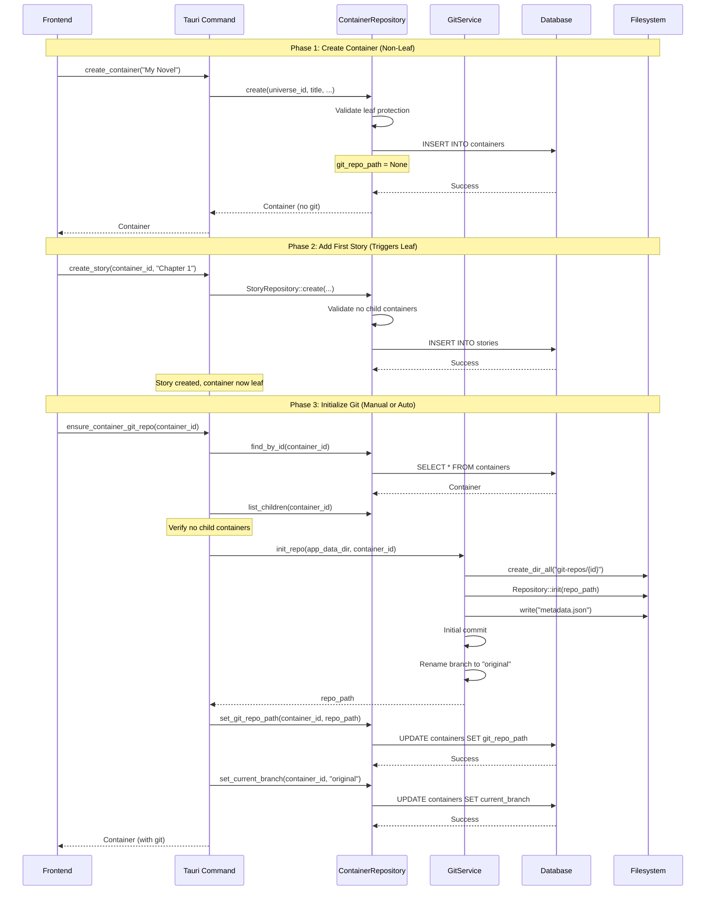
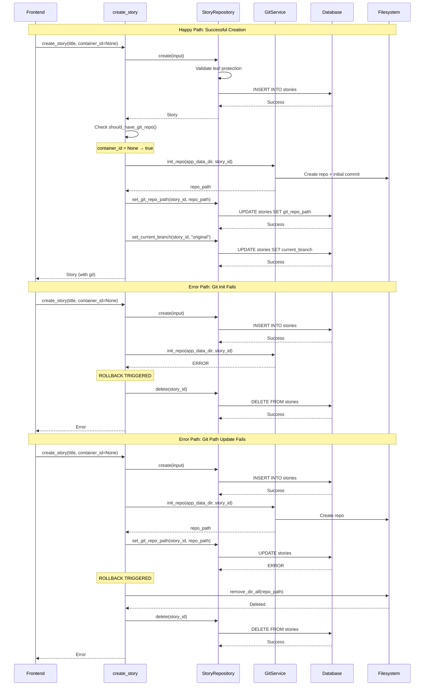
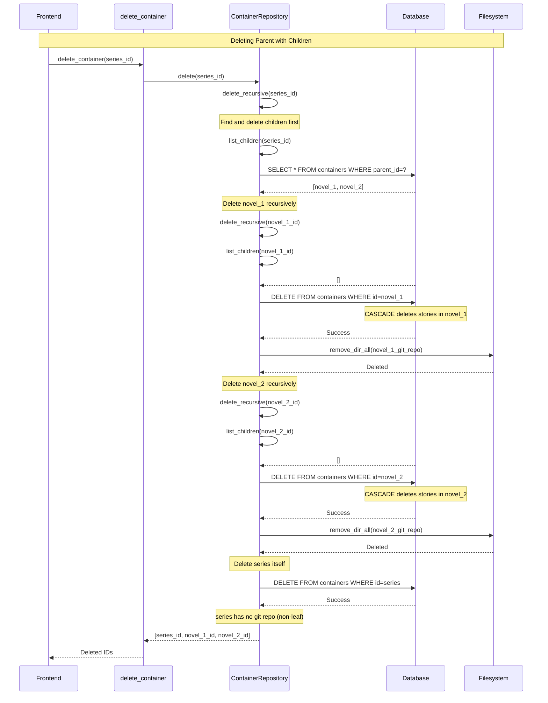

# Git Repository Initialization Lifecycle

This document describes the lifecycle of Git repositories in the Bright application, including initialization rules, ownership patterns, transaction handling, and cleanup procedures.

## Overview

Bright uses Git repositories to track version history for written content. Not all entities have their own Git repositories - only **leaf containers** (containing stories) and **standalone stories** maintain independent repositories.

## Git Repository Ownership Rules

### Who Gets a Git Repository?

1. **Leaf Containers** (containers containing stories)
   - Have their own Git repository
   - All child stories share this repository
   - Example: A novel container with chapters

2. **Standalone Stories** (container_id = None)
   - Have their own Git repository
   - Independent versioning
   - Example: A short story not part of any collection

### Who Does NOT Get a Git Repository?

1. **Non-Leaf Containers** (containers containing child containers)
   - NO Git repository
   - Only serve organizational purposes
   - Example: A series container with multiple novels

2. **Child Stories** (container_id = Some(id))
   - NO individual Git repository
   - Share parent container's repository
   - Example: Chapters within a novel

## Repository Path Structure

All Git repositories are stored under the application data directory:

```
{app_data_dir}/git-repos/{entity_id}/
```

For example:
- `/path/to/app-data/git-repos/container-uuid-123/.git`
- `/path/to/app-data/git-repos/story-uuid-456/.git`

Each repository contains:
- `.git/` - Git metadata directory
- `metadata.json` - Entity metadata (story_id, created_at, version)
- Story content files (created when stories are saved)

## Initialization Process

### Container Initialization

Containers are created in two phases:

**Phase 1: Database Creation** (`ContainerRepository::create`)
```rust
// 1. Validate parent doesn't have stories (leaf protection)
if parent_has_stories() {
    return Err("Cannot add child container to container with stories");
}

// 2. Create container record in database
db.execute("INSERT INTO containers (...) VALUES (...)");

// 3. Git repository NOT created yet (git_repo_path = None)
```

**Phase 2: Git Initialization** (`ensure_container_git_repo` command)
```rust
// 1. Verify container has no child containers (leaf validation)
if has_child_containers() {
    return Err("Cannot add git repo to container with children");
}

// 2. Initialize Git repository
GitService::init_repo(app_data_dir, container.id);

// 3. Update database with git_repo_path
ContainerRepository::set_git_repo_path(db, container.id, repo_path);

// 4. Set current branch (typically "original")
ContainerRepository::set_current_branch(db, container.id, "original");
```

**Why Two Phases?**
- Containers can be created before knowing if they'll contain stories or child containers
- Git repository is only initialized when the container becomes a leaf (first story added)
- Frontend can explicitly initialize via `ensure_container_git_repo` command

### Story Initialization

Stories are created atomically with rollback support:

**Standalone Story Creation** (`create_story` command)
```rust
// 1. Create story in database
let story = StoryRepository::create(db, input)?;

// 2. Check if story should have git repo (container_id = None)
if story.should_have_git_repo() {
    // 3. Initialize git repository
    let repo_path = GitService::init_repo(app_data_dir, story.id)
        .map_err(|e| {
            // ROLLBACK: Delete story from database
            StoryRepository::delete(db, story.id);
            e
        })?;

    // 4. Update git_repo_path
    StoryRepository::set_git_repo_path(db, story.id, repo_path)
        .map_err(|e| {
            // ROLLBACK: Delete git repo and database record
            fs::remove_dir_all(repo_path);
            StoryRepository::delete(db, story.id);
            e
        })?;

    // 5. Set current branch
    StoryRepository::set_current_branch(db, story.id, "original")?;
}
```

**Child Story Creation** (`create_story` with container_id)
```rust
// 1. Validate container doesn't have child containers (leaf protection)
if container_has_children() {
    return Err("Cannot add story to container with children");
}

// 2. Create story in database
let story = StoryRepository::create(db, input)?;

// 3. NO git repo initialization (shares container's repo)
// git_repo_path remains empty string
```

## Git Repository Initialization Details

The `GitService::init_repo` method performs the following:

1. **Create directory structure**
   ```
   {base_path}/git-repos/{entity_id}/
   ```

2. **Initialize Git repository**
   ```rust
   Repository::init(repo_path)
   ```

3. **Create initial metadata.json**
   ```json
   {
     "story_id": "entity-uuid",
     "created_at": "2024-01-01T00:00:00Z",
     "version": "1.0.0"
   }
   ```

4. **Create initial commit**
   - Stages `metadata.json`
   - Creates commit with message "Initial commit"
   - Uses signature from git config or defaults to "Bright <noreply@bright.app>"

5. **Rename default branch to "original"**
   - Renames "master" or "main" to "original"
   - Safety: Only renames known default branches
   - Logs warning if custom default branch detected

## Transaction Handling and Rollback

### Atomic Operations

All Git repository creation is transactional with automatic rollback on failure:

**Container Git Initialization Rollback**
```rust
// If git init fails → database unchanged, no git repo created
// If path update fails → delete git repo directory, database unchanged
// If branch update fails → delete git repo, clear path in database
```

**Story Creation Rollback**
```rust
// If git init fails → delete story from database
// If path update fails → delete git repo + database record
// If branch update fails → delete git repo + database record
```

### Database Transactions

Container deletion uses database transactions for consistency:

```rust
// Start transaction
conn.execute("BEGIN TRANSACTION", [])?;

// Delete container
conn.execute("DELETE FROM containers WHERE id = ?", [id])?;

// Commit (automatic rollback on error via Drop)
conn.execute("COMMIT", [])?;

// Clean up filesystem (best effort)
fs::remove_dir_all(git_repo_path); // Logged if fails
```

## Leaf Protection Mechanism

Leaf protection ensures containers contain **either** child containers **or** stories, but never both.

### Validation Points

**1. Adding Child Container to Parent**
```rust
// In ContainerRepository::create
if parent_container_id.is_some() {
    let story_count = get_story_count(parent_id)?;
    if story_count > 0 {
        return Err("Cannot add child container to container with stories");
    }
}
```

**2. Adding Story to Container**
```rust
// In StoryRepository::create
if container_id.is_some() {
    let child_count = get_child_container_count(container_id)?;
    if child_count > 0 {
        return Err("Cannot add story to container with children");
    }
}
```

**3. Initializing Git Repository**
```rust
// In ensure_container_git_repo command
let child_containers = ContainerRepository::list_children(db, id)?;
if !child_containers.is_empty() {
    return Err("Container has children, cannot have git repo");
}
```

### Example Hierarchy

```
Series (non-leaf, no git)
├── Novel 1 (leaf, git repo: /app-data/git-repos/novel-1-uuid/)
│   ├── Chapter 1 (shares Novel 1's repo)
│   ├── Chapter 2 (shares Novel 1's repo)
│   └── Chapter 3 (shares Novel 1's repo)
└── Novel 2 (leaf, git repo: /app-data/git-repos/novel-2-uuid/)
    ├── Chapter 1 (shares Novel 2's repo)
    └── Chapter 2 (shares Novel 2's repo)

Standalone Story (git repo: /app-data/git-repos/story-uuid/)
```

## Cleanup and Deletion

### Container Deletion

**Process**:
1. Recursively find all child containers
2. Delete each child (depth-first)
3. Delete container from database (CASCADE deletes stories)
4. Remove git repository from filesystem (if exists)

**Implementation** (`ContainerRepository::delete_recursive`):
```rust
// 1. Get all children
let children = ContainerRepository::list_children(db, id)?;

// 2. Recursively delete each child
for child in children {
    delete_recursive(db, child.id)?;
}

// 3. Delete from database (CASCADE handles stories)
db.execute("DELETE FROM containers WHERE id = ?", [id])?;

// 4. Clean up git repo (best effort)
if let Some(git_repo_path) = container.git_repo_path {
    if Path::new(&git_repo_path).exists() {
        fs::remove_dir_all(&git_repo_path)?; // Logged if fails
    }
}
```

**Orphaned Repository Protection**:
- If filesystem cleanup fails, database deletion still completes
- Warning is logged: "Failed to remove git repo directory..."
- Future enhancement: Maintenance command to find/remove orphaned repos

### Story Deletion

**Process**:
1. Delete story from database
2. Remove git repository (if standalone story)

**Implementation** (`delete_story` command):
```rust
// 1. Delete from database
StoryRepository::delete(db, id)?;

// 2. Clean up git repo (standalone stories only)
let repo_path = app_data_dir.join("git-repos").join(&id);
if repo_path.exists() {
    fs::remove_dir_all(&repo_path)?;
}
```

## Branch Management

### Default Branch: "original"

All new repositories use "original" as the default branch name:
- Conceptually represents the "original" version of the story
- Renamed from system default ("master" or "main")
- Safety: Only known defaults are renamed

### Current Branch Tracking

The database tracks the current branch for each entity:
- `containers.current_branch` - Current branch for container's repo
- `stories.current_branch` - Current branch for story's repo

**Branch Synchronization**:
```rust
// ensure_container_git_repo syncs branch from repo
let actual_branch = GitService::get_current_branch(repo_path)?;
if actual_branch != container.current_branch {
    ContainerRepository::set_current_branch(db, id, actual_branch)?;
}
```

## Sequence Diagrams

### Container Creation with Stories



### Standalone Story Creation with Rollback



### Container Deletion with Cascade



## Key Implementation Files

### Backend (Rust)
- `src-tauri/src/git.rs` - GitService with init_repo, commit, branch operations
- `src-tauri/src/repositories/container.rs` - Container CRUD with leaf protection
- `src-tauri/src/repositories/story.rs` - Story CRUD with leaf protection
- `src-tauri/src/commands/container.rs` - ensure_container_git_repo command
- `src-tauri/src/commands/story.rs` - create_story with atomic git init
- `src-tauri/src/db/migrations.rs` - Database schema with git fields

### Database Schema
```sql
CREATE TABLE containers (
    id TEXT PRIMARY KEY,
    universe_id TEXT NOT NULL,
    parent_container_id TEXT,
    container_type TEXT NOT NULL,
    title TEXT NOT NULL,
    description TEXT,
    "order" INTEGER NOT NULL DEFAULT 0,
    git_repo_path TEXT,              -- NULL for non-leaf containers
    current_branch TEXT,              -- NULL for non-leaf containers
    created_at TEXT NOT NULL,
    updated_at TEXT NOT NULL
);

CREATE TABLE stories (
    id TEXT PRIMARY KEY,
    universe_id TEXT NOT NULL,
    container_id TEXT,                -- NULL for standalone stories
    title TEXT NOT NULL,
    content TEXT NOT NULL DEFAULT '',
    git_repo_path TEXT NOT NULL,      -- Empty string if shares container repo
    current_branch TEXT NOT NULL,     -- "main" default
    ...
);
```

## Common Patterns

### Creating a Novel with Chapters

**Pattern**: Leaf container with child stories

```typescript
// 1. Create novel container
const novel = await invoke('create_container', {
  input: {
    universe_id: 'universe-1',
    container_type: 'novel',
    title: 'My Novel',
    parent_container_id: null
  }
});
// novel.git_repo_path = null (not initialized yet)

// 2. Add first chapter (triggers leaf)
const chapter1 = await invoke('create_story', {
  input: {
    universe_id: 'universe-1',
    container_id: novel.id,  // Part of novel
    title: 'Chapter 1'
  }
});
// chapter1.git_repo_path = "" (shares container repo)

// 3. Initialize git for novel (now a leaf)
const novelWithGit = await invoke('ensure_container_git_repo', {
  id: novel.id
});
// novelWithGit.git_repo_path = "/app-data/git-repos/{novel-id}/"
// novelWithGit.current_branch = "original"

// 4. Add more chapters (all share novel's repo)
const chapter2 = await invoke('create_story', {
  input: {
    container_id: novel.id,
    title: 'Chapter 2'
  }
});
```

### Creating a Series of Novels

**Pattern**: Non-leaf container with child leaf containers

```typescript
// 1. Create series container
const series = await invoke('create_container', {
  input: {
    container_type: 'series',
    title: 'My Series'
  }
});
// series.git_repo_path = null (non-leaf, never gets git)

// 2. Create first novel in series
const novel1 = await invoke('create_container', {
  input: {
    parent_container_id: series.id,  // Child of series
    container_type: 'novel',
    title: 'Book 1'
  }
});

// 3. Add chapters to novel1
const chapter = await invoke('create_story', {
  input: {
    container_id: novel1.id,
    title: 'Chapter 1'
  }
});

// 4. Initialize git for novel1 (leaf)
await invoke('ensure_container_git_repo', { id: novel1.id });
// novel1.git_repo_path = "/app-data/git-repos/{novel1-id}/"

// 5. Create second novel (separate git repo)
const novel2 = await invoke('create_container', {
  input: {
    parent_container_id: series.id,
    container_type: 'novel',
    title: 'Book 2'
  }
});

// Each novel has its own git repo, series has none
```

### Creating a Standalone Short Story

**Pattern**: Standalone story with own git repo

```typescript
// Single operation creates story + git repo atomically
const story = await invoke('create_story', {
  input: {
    universe_id: 'universe-1',
    container_id: null,  // Standalone
    title: 'Short Story',
    story_type: 'short-story'
  }
});
// story.git_repo_path = "/app-data/git-repos/{story-id}/"
// story.current_branch = "original"
// Git repo automatically initialized with metadata.json
```

## Future Enhancements

### Planned Improvements

1. **Orphaned Repository Cleanup**
   - Maintenance command: `cleanup_orphaned_repos`
   - Scan git-repos directory
   - Cross-reference with database
   - Remove directories without corresponding entities

2. **Git Repository Compaction**
   - Periodic garbage collection
   - Prune unreachable objects
   - Optimize pack files

3. **Backup and Migration**
   - Export git repositories with entities
   - Import repositories into new installation
   - Maintain commit history during migration

4. **Multi-Repository Operations**
   - Batch commit across multiple repos
   - Cross-repository branch management
   - Series-wide version tagging

## Troubleshooting

### Git Repository Missing

**Symptom**: Entity has `git_repo_path` but directory doesn't exist

**Diagnosis**:
```sql
SELECT id, title, git_repo_path FROM containers WHERE git_repo_path IS NOT NULL;
```

**Resolution**:
```typescript
// Re-initialize git repo
await invoke('ensure_container_git_repo', { id: container_id });
```

### Cannot Add Story to Container

**Symptom**: Error "Cannot add story to container with children"

**Diagnosis**:
```sql
SELECT COUNT(*) FROM containers WHERE parent_container_id = '{container_id}';
```

**Resolution**: Container has child containers. Either:
1. Remove child containers first
2. Add story to a leaf container (child) instead

### Cannot Add Child Container

**Symptom**: Error "Cannot add child container to container with stories"

**Diagnosis**:
```sql
SELECT COUNT(*) FROM stories WHERE container_id = '{container_id}';
```

**Resolution**: Container has stories. Either:
1. Move stories elsewhere
2. Create new parent container for hierarchy

## Summary

The Git repository lifecycle in Bright follows these principles:

1. **Selective Initialization**: Only leaf containers and standalone stories have Git repos
2. **Atomic Operations**: Creation, initialization, and updates are transactional with rollback
3. **Leaf Protection**: Containers contain either children or stories, never both
4. **Automatic Cleanup**: Deletion cascades through hierarchy and removes filesystem artifacts
5. **Branch Tracking**: Database syncs with actual repository state
6. **Safe Defaults**: Repositories use "original" branch, safe rename logic

This design ensures version control is applied where it matters (actual content) while minimizing complexity and storage overhead for organizational structures.
